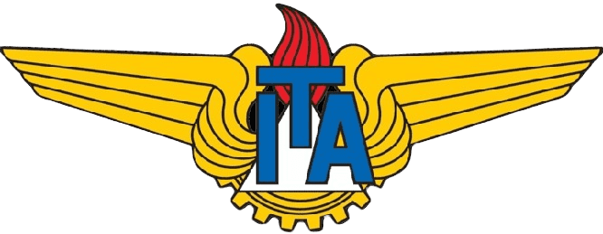

<h3 align="center">Repositório para acompanhamento das aulas</h3>

 <!--

-->

# [Curso de Orientação a Objetos](https://www.coursera.org/learn/orientacao-a-objetos-com-java)

## Introdução

Bem-vindo ao curso de Orientação a Objetos oferecido pelo Coursera! Este curso tem como objetivo fornecer uma compreensão profunda dos conceitos fundamentais da orientação a objetos, utilizando a linguagem de programação Java para ilustrar os princípios.

## Estrutura do Curso

O curso está dividido em dois módulos, cada um composto por várias lições e atividades práticas para reforçar o aprendizado. A seguir, uma visão geral do conteúdo de cada módulo.

## Módulo 1

* **Introdução e Visão Geral do Curso**
  * Nesta seção, você será apresentado ao curso, incluindo os objetivos, a estrutura e os principais tópicos que serão abordados.

* **Conhecendo as Classes**
  * Aqui, você aprenderá sobre o conceito de classes em orientação a objetos, incluindo sua definição e importância.

* **Conhecendo as Classes com Java**
  * Nesta lição, exploraremos como as classes são implementadas na linguagem de programação Java, com exemplos práticos.

* **CRC: Classe, Responsabilidade e Colaboração**
  * Você será introduzido à técnica CRC (Classe, Responsabilidade e Colaboração), uma ferramenta valiosa para a modelagem de classes e suas interações.

* **Avaliação pelos pares**
  * Neste ponto do curso, você terá a oportunidade de aplicar o que aprendeu através de uma avaliação pelos pares, onde revisará o trabalho de seus colegas e receberá feedback sobre o seu próprio trabalho.

* **Material Complementar**
  * Materiais adicionais para leitura e estudo serão fornecidos para aprofundar seu entendimento dos conceitos discutidos.

## Módulo 2

* **Lesson 1: Aprofundando nas Classes com Java**
  * Nesta lição, vamos nos aprofundar ainda mais na implementação de classes em Java, explorando conceitos avançados e boas práticas.

* **Lesson 2: Modelagem CRC**
  * Continuaremos a explorar a modelagem CRC, aplicando a técnica em exemplos mais complexos e detalhados.

* **Avaliação por pares**
  * Outra avaliação pelos pares será realizada, permitindo que você refine suas habilidades de modelagem e receba feedback construtivo.

* **Material Complementar**
  * Mais recursos e leituras complementares serão disponibilizados para apoiar seu aprendizado contínuo.

## Módulo 3

* **Testes de Unidade**
  * Aprender a importância dos testes de unidade no desenvolvimento de software e como implementá-los para garantir a qualidade do código.

* **Diagramas UML**
  * Explorar os diagramas UML (Linguagem de Modelagem Unificada) para visualizar e documentar a estrutura e comportamento dos sistemas orientados a objetos.

* **Avaliação pelos pares**
  * Aplicar o que aprendeu através de uma avaliação pelos pares, revisando o trabalho de seus colegas e recebendo feedback sobre o seu próprio.

* **Material Complementar**
  * Praticar tarefa avaliada por colega: Testes do Cálculo do IMC.

## Módulo 4

* **Conhecendo a Herança**
  * Descubra o conceito de herança em orientação a objetos, um princípio fundamental que permite a criação de novas classes baseadas em classes existentes.

* **Acesso aos Objetos**
  * Aprenda sobre os diferentes níveis de acesso aos objetos e como controlar a visibilidade e a manipulação de dados e métodos dentro de suas classes.

* **Aprofundando na Herança**
  * Explore mais detalhadamente a herança, incluindo suas vantagens, desvantagens e melhores práticas para usá-la de forma eficaz em seus projetos.

* **Avaliação pelos pares**
  * Aplique o que aprendeu através de uma avaliação pelos pares, revisando o trabalho de seus colegas e recebendo feedback sobre o seu próprio.

* **Material Complementar**
  * Praticar tarefa avaliada por colega: Compra Parcelada com Juros

## Módulo 5

* **Encapsulamento**
  * Entenda o princípio do encapsulamento, que protege os dados dentro de um objeto e controla como esses dados são acessados e modificados.

* **Interfaces em Java**
  * Explore o uso de interfaces em Java para definir contratos que classes podem implementar, permitindo uma maior flexibilidade e desacoplamento no design do software.

* **Aprofundando na Herança**
  * Continue a aprofundar seu conhecimento sobre herança, examinando cenários avançados e boas práticas para utilizar a herança de maneira eficiente.

* **Avaliação pelos pares**
  * Aplique o que aprendeu através de uma avaliação pelos pares, revisando o trabalho de seus colegas e recebendo feedback sobre o seu próprio.

* **Material Complementar**
  * Hands-on: Problema no Encapsulamento de Arrays
  * Praticar tarefa avaliada por colega: Métodos de Acesso para Data

## Módulo 6

* **Sobre Polimorfismo**
  * Aprenda sobre polimorfismo, um dos princípios fundamentais da orientação a objetos, que permite que objetos de diferentes classes sejam tratados de maneira uniforme.

* **Law of Demeter**
  * Explore a Lei de Demeter, também conhecida como princípio do mínimo conhecimento, que sugere que um objeto deve ter um conhecimento limitado de outros objetos para reduzir o acoplamento.

* **Exceções em Java**
  * Entenda como lidar com exceções em Java, incluindo a criação e o gerenciamento de exceções para tornar seu código mais robusto e resiliente.

* **Exercício Final do Curso**
  * Jodas de Palavras Embaralhadas: Aplique todos os conceitos aprendidos em um exercício final desafiador que envolve a criação de um jogo de palavras embaralhadas.

* **Material Complementar**
  * Praticar tarefa avaliada por colega: Exceções para ler um arquivo

